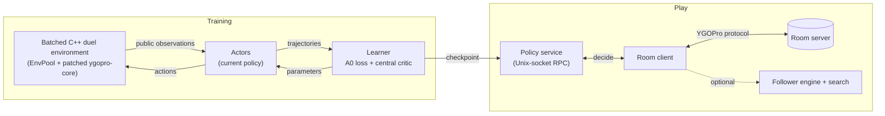

# MirrorForce

MirrorForce is a Yu-Gi-Oh! OCG agent trained purely by self-play reinforcement learning on the YGOPro rules
engine. It is named after the trap card *Mirror Force*: read the opponent's attack, then turn it back on them.

- **Champion of the first YGO agent competition** (retro Sky Striker mirror match), and **drew 1:1 with the Sky
  Striker human champion 第十四位奏者** over two best-of-seven matches
  ([announcement](https://www.bilibili.com/opus/1256117444081090563)).
- A 28M-parameter transformer policy trained for about 3 days on 32 H20 GPUs, from scratch, with a regularized
  policy-gradient recipe adapted from Ataraxos (Stratego).
- Plays online through YGOPro-compatible room servers; an optional play-time search module rebuilds the game
  locally from the server's public messages.

The implementation builds on two pieces of prior work: the environment, model and trainer started from
[ygo-agent](https://github.com/sbl1996/ygo-agent), and the training recipe follows *Scalable decision-making for
games of imperfect information* (Sokota et al., Nature 2026,
[doi:10.1038/s41586-026-11036-y](https://doi.org/10.1038/s41586-026-11036-y)).

The champion's weights (iteration 1,084) are attached to the [first release](../../releases); card data and training
data are not part of this repository.

## Training progress


Each point is a fixed checkpoint evaluated greedily, without search, on a fixed set of 100 to 200 deals with both
turn orders. **Left:** Elo on our internal self-play scale; the dashed line is a strong reference agent from an
earlier PPO training run, which checkpoints from iteration 600 on beat about 82% to 87% of the time. **Right:** win
rate against WinBot (WindBot, the scripted bot of the YGOPro ecosystem).

## Key techniques

- **Self-play with a regularized policy gradient (A0).** Every kept decision is trained on a PPO-clip objective plus
  a KL pull toward the uniform distribution over legal actions (the "magnet", with a decaying temperature), a
  categorical TD(λ=0.8) value loss and a KL penalty to the behaviour policy. Advantages come from GAE(λ=0.5), only
  decisions with the largest absolute advantages are kept (top 25%, at least 0.01). An exponential moving average
  of the parameters (decay 0.999) is kept beside them; actors and the released champion use the latest parameters.
- **Information boundary.** The policy sees only what a real client sees: its own hand and deck list, both
  sides' public zones and the public event history. A central critic that may read hidden information is used for
  advantage estimation during training only and never acts.
- **Card-level transformer.** Every card is a token: database fields, structural features of its Lua script and a
  per-card identity residual. A set transformer encodes the board, a causal transformer encodes the events of the
  current turn, and each earlier turn is compressed into one summary token (up to 64 are kept).
- **Action-query policy head.** Each legal action is a query that cross-attends to the board tokens, so the
  network scores actions of any menu size. Learned value queries read the board and the legal menu and predict
  win/draw/loss. An auxiliary belief head predicts the composition of the opponent's hidden cards.
- **Batched C++ environment.** Hundreds of duels run on threads in one process (EnvPool style) on a patched
  ygopro-core with deterministic effect ordering, thread-safe global state and whole-duel snapshots.
- **Distributed actor–learner.** A Cleanba-style JAX trainer with separate actor and learner devices; each
  iteration collects about 4.9 million decisions, then takes 200 learner steps.
- **Optional play-time search.** A local *follower* engine replays every public message from the server and
  infers the opponent's choices and random outcomes from later public messages, with placeholders for unseen cards.
  Search samples hidden-card assignments consistent with the public record, rolls each one forward in the local
  engine and scores it with the value head. By default it runs only when every opponent card is known (lethal
  checks), within a per-step time budget and the room clock.
- **Reproducibility.** Checkpoints are content-addressed by SHA-256 and carry a receipt with the configuration,
  source revision, engine digest and rule versions; resuming verifies them.

## Architecture

The design is described in more detail in [docs/](docs/): [system architecture](docs/architecture.md),
[model](docs/model.md), [observation and features](docs/features.md), [training](docs/training.md) and
[play-time search](docs/search.md).



The policy network (`mirrorforce/mirrorforce/agent/model/policy_net.py`):

```
cards ──► card embeddings (database fields + Lua features + identity) ──► set transformer (4 layers, d=384) ─┐
events of this turn ──► causal transformer (2 layers) ◄── summary tokens of earlier turns (≤64) ───────────┤
                                                                                                           ▼
            legal actions ──► action queries ──cross-attention──► policy logits
            value queries ──► board + legal menu ──────────────► win / draw / loss
            belief head ─────────────────────────────────────────► opponent hidden-card composition (auxiliary)
```

The policy has 28.1M parameters (5.9M of them in the card-semantics projection) and the central critic 9.4M;
both run in bfloat16.

## Repository layout

| Path | Contents |
|---|---|
| `mirrorforce/mirrorforce/agent/` | Environment wrapper, model, trainer (`train/cleanba.py`, `train/ataraxos.py`), card-semantics builder |
| `mirrorforce/mirrorforce/netduel/` | YGOPro network protocol, room client, public disclosure ledger, play-time search policy |
| `mirrorforce/mirrorforce/common/` | Follower engine (`client_sync.py`, `client_shadow.py`, `client_root.py`) and shared artifact I/O |
| `mirrorforce/mirrorforce/search/`, `worldmodel/`, `puzzle/` | Belief sampler and particles, engine driver and state capture, ctypes engine loader |
| `mirrorforce/mirrorforce/cardrules/` | Card rule tables built from the card database and Lua scripts |
| `mirrorforce/cxx/duelpool/`, `mirrorforce/cxx/mfenv/` | Batched C++ duel environment, its build script and the public-history sources it compiles |
| `mirrorforce/script-overrides/` | Runtime-equivalent scripts for two cards whose stock scripts enumerate exponentially |
| `mirrorforce/tools/` | Policy service, room client, card-table builders, follower replay audit |
| `mirrorforce/tests/` | Unit and contract tests |
| `mirrorforce/decks/` | Decks (the mirror match uses `stage-a/SkyStriker.ydk`) |
| `mirrorforce/sdk/room/` | A minimal SDK for connecting your own agent to a room |
| `third_party/ygopro-core/` | The patched rules engine (git submodule) |

## Requirements

- Linux x86-64, Python 3.11, and the packages in [`requirements.txt`](requirements.txt) (JAX 0.5.3, Flax 0.10.4,
  optax, chex, distrax and others). Install the CUDA build of JAX for GPU training. The follower and some shared
  modules also use PyTorch (a CPU build is enough) and pyarrow.
- A C++17 compiler, Lua 5.3 and SQLite development files for the engine and the environment extension.
- A YGOPro card database (`cards.cdb`) and the Lua card scripts, from the YGOPro community repositories.

## Building

```bash
git clone --recursive <this repository>
cd MirrorForce

# 1. The rules engine as a plain shared library, used by the follower and the engine tests
MF_CORE_ROOT=third_party/ygopro-core MF_BUILD_ROOT=<output directory> MF_LUA_INC=<Lua 5.3 include directory> \
    bash mirrorforce/build/effectinfo/build-effectinfo-core.sh
export MF_EFFECTINFO_LIB=<output directory>/effectinfo/libygopro-core-effectinfo.so

# 2. The batched environment extension (sources are taken from git commits, so commit local changes first)
python3 mirrorforce/cxx/duelpool/build.py --rev <commit> --core third_party/ygopro-core --core-rev <core commit> \
    --deps <directory of dependency snapshots> --out <new output directory>
export MF_DUEL_NATIVE=<output directory>/duel_native.cpython-311-x86_64-linux-gnu.so
```

The dependency snapshots (pybind11, fmt, SQLiteCpp, concurrentqueue, Lua and others) and their digests are listed
in `mirrorforce/cxx/duelpool/deps.json`; the build checks every one before compiling.

Paths to local builds and data are passed through environment variables; set the ones your workflow needs:

| Variable | Meaning |
|---|---|
| `MF_DUEL_NATIVE` | The built environment extension (`duel_native…so`) |
| `MF_EFFECTINFO_LIB` | The engine library built in step 1, for the follower and the engine tests |
| `MF_YGOPRO_RUN` | A YGOPro client directory holding `cards.cdb` and `script/` |
| `MF_YGOPRO_DB` | The card database, when it is not under `MF_YGOPRO_RUN` |
| `MF_TEST_ASSETS`, `MF_SCRIPTED_RUN` | Card tables and a client directory for the engine-backed tests |

## Usage

Run the commands below from `mirrorforce/`. Every tool documents its full set of options with `--help`; values in
angle brackets are yours to fill in.

**Train.** On one machine:

```bash
python -m mirrorforce.agent.train.cleanba --help
```

Across several machines, start one process per machine with the same coordinator:

```bash
python -m mirrorforce.agent.train.cleanba <training options> \
    --distributed --coordinator-address <HOST:PORT> --num-processes <N> --process-id <I>
```

The champion's full set of training options, and how to continue training from the released weights, are in
[docs/training.md](docs/training.md#the-champions-configuration).

**Serve a policy.**

```bash
python -m tools.mf_runtime_policy_service --checkpoint <checkpoint>.ckpt --weights iterate --selection greedy \
    --cards-db <cards.cdb> --code-list <code list> --script-root <script directory> \
    --announce-tables <announce tables> --semantic-file <semantic table> --card-tables <card tables> \
    --warmup-deck decks/stage-a/SkyStriker.ydk --opponent-mode mirror \
    --socket <socket path> --out <new output directory>
```

**Join a room.** The league client reads a JSON plan (rooms, series, policy socket, deck) and a credentials file
with mode 0600; room passwords are read only from that file and never appear on the command line or in logs.
`--prepare-only` validates everything without connecting:

```bash
python -m tools.mf_runtime_league_client --plan <plan.json> --plan-sha256 <plan digest> \
    --credentials-file <credentials.json> --out <new output directory> --prepare-only
```

**Search switch.** Search is off by default: the policy service and the league client play the plain greedy
policy, as in the competition. The search module ships as a library
(`mirrorforce/mirrorforce/netduel/agent_search_policy.py`, with the follower in `mirrorforce/mirrorforce/common/`)
and is configured by registered settings rather than free parameters:

| Setting | Meaning |
|---|---|
| `final_search.settings("off")` | No search; returns `None` and never constructs the follower |
| `final_search.settings("on")` | On-demand search within the room clock (10 s per prompt, 8 hypotheses) |
| `untimed_search.settings()` | The same search without time limits, for evaluation only |

The hidden-card proposal is chosen with `make_particle_provider("public_current_root_uniform")` or
`make_particle_provider("public_current_root_count_head")` (resampled with the policy's count-belief head). A room
client that drives the search is not part of this release; [docs/search.md](docs/search.md) describes the follower,
the root search and when it triggers.

**Use the released weights.** Download the release bundle, unpack it and point the service at its files:

```bash
python -m tools.mf_runtime_policy_service --checkpoint <bundle>/checkpoint/<sha256>.ckpt --weights iterate \
    --selection greedy --cards-db <bundle>/cards.cdb --code-list <bundle>/code_list.txt --script-root <bundle> \
    --announce-tables <bundle>/announce-tables-<sha256>.json --semantic-file <bundle>/frozen_semantics.npz \
    --card-tables <bundle>/card-tables-<sha256>.npz --warmup-deck decks/stage-a/SkyStriker.ydk --opponent-mode mirror \
    --socket <socket path> --out <new output directory>
```

`--script-root` is the directory that contains `script/`. The bundle's `MANIFEST.json` lists every file with its
SHA-256, and the service checks the card database, code list and tables against the checkpoint's receipt. We
checked that this code with the bundle gives bit-identical policy and value outputs to the code and files the
champion played with. Two policy services and two room clients in a YGOPro room play the agent against itself or against another
checkpoint.

**Audit the follower.** `tools/mf_runtime_follower_replay_audit.py` replays recorded online games through the follower
and reports the first difference between the server's messages and the local engine's, if any.

**Test.**

```bash
PYTHONPATH=. python -m pytest tests -q -p no:cacheprovider
```

Tests that need the compiled extension or card data skip themselves when those are missing; set the environment
variables above to run them.

## TODO and known issues

- **Information leakage.** The agent tends to set cards as soon as it draws them, normal spells included, which
  gives the opponent information for free.
- **Rare tactics.** Some strong lines are never found, for example transforming Raye into Kagari during the Battle
  Phase to dodge Effect Veiler, or using Area Zero for free value.
- **One deck.** Only the Sky Striker mirror is trained. More decks, modern card pools and randomized hand traps are
  next.
- **Play-time search.** Search has not yet shown a measured gain over the plain policy. The room client that drives
  search is not released yet, and when the follower loses sync the client leaves the game instead of falling back to
  the plain policy.
- **Belief.** The opponent-hand belief is an auxiliary head; neither the policy nor the search reads it yet.
- **Training ideas.** Attention over the full cross-turn history; counterfactual replays of lost games to find the
  decisive decisions; exploiter agents that target the main agent's weaknesses.

## License

MIT; see [LICENSE](LICENSE). Third-party code and the scripts distributed under GPL-2.0 are listed in
[THIRD_PARTY_NOTICES.md](THIRD_PARTY_NOTICES.md).

## Acknowledgements

- [sbl1996/ygo-agent](https://github.com/sbl1996/ygo-agent) (MIT): the environment, model and trainer started from
  a fork of this project, imported with the fork author's consent.
- 呼呼啦啦咕咕咔嚓: our input-feature code draws on the feature design of the GGBOY agent.
- [Fluorohydride/ygopro-core](https://github.com/Fluorohydride/ygopro-core) (MIT): the rules engine.
- [EnvPool](https://github.com/sail-sg/envpool) (Apache-2.0): the batched environment framework.
- [Cleanba](https://github.com/vwxyzjn/cleanba): the distributed training layout.
- Sokota et al., *Scalable decision-making for games of imperfect information*, Nature 2026
  ([doi:10.1038/s41586-026-11036-y](https://doi.org/10.1038/s41586-026-11036-y)): the A0 training recipe.
- The organizers and participants of the first YGO agent competition.
