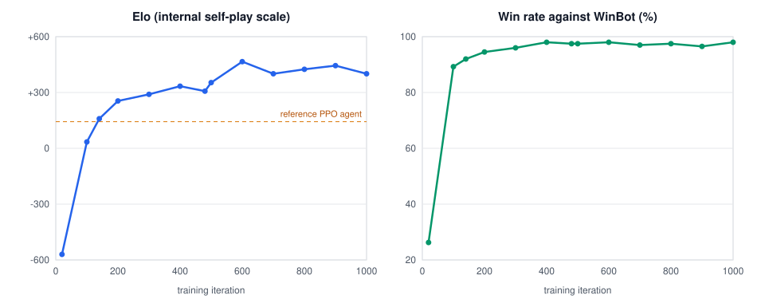
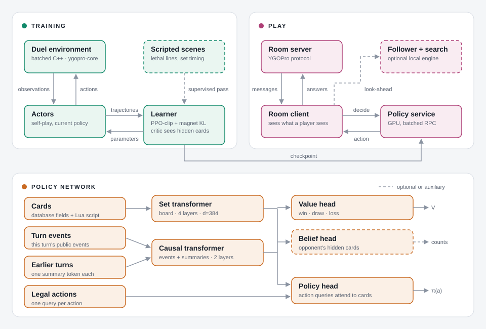

# MirrorForce

MirrorForce is a Yu-Gi-Oh! OCG agent trained by self-play reinforcement learning on the YGOPro rules engine, named
after the trap card *Mirror Force*.

- **Champion of the first YGO agent competition** (retro Sky Striker mirror,
  [announcement](https://www.bilibili.com/opus/1256117444081090563)). Against the Sky Striker human champion
  **第14位奏者** it won the first best-of-seven 5–3 (two of the three losses were agent disconnections) and lost
  the second 3–4. Replays are in [`replay/`](replay/).
- A 28M-parameter transformer trained from scratch for about 3 days on 32 H20 GPUs.
- The champion's weights (iteration 1,084) are attached to the [first release](../../releases).

**Deck scope.** Training so far uses only the Sky Striker deck in [`deck/SkyStriker.ydk`](deck/SkyStriker.ydk), so
the released weights play only this deck, in the mirror match. The architecture is not tied to one deck: cards are
described by their database fields and script features over the whole card pool, and the trainer samples decks from
a pool, so multi-deck training is supported in principle.

## Training progress



Each point is a checkpoint played greedily on fixed deals with both turn orders: internal Elo (left) and win rate
against WinBot, the scripted YGOPro bot (right).

## Key techniques

- **Entity transformer over cards.** Every card is a token built from its database fields and the structure of its
  Lua script. A set transformer encodes the board, a causal transformer the events of the current turn, and each
  earlier turn is kept as one summary token. Each legal action is a query that attends to the cards, so menus of any
  size are scored.
- **Self-play PPO with a magnet KL.** PPO-clip plus a KL pull toward the uniform policy over legal actions with
  a decaying temperature, following the Ataraxos recipe. A central critic that sees hidden cards estimates
  advantages during training only; the policy sees only what a real client sees.
- **Targeted scenario training.** Scripted demonstrations of tactical scenes the agent missed (lethal lines,
  clearing the field before attacking, the timing of defensive sets) were mixed into training; see
  [docs/training.md](docs/training.md).
- **Follower and local search (optional, off by default).** A local engine replays the server's public messages
  and infers the opponent's choices from their results, so the client can look ahead: it samples hidden cards
  consistent with the public record and rolls each candidate line forward with the policy and value head.

## Architecture



More in [docs/](docs/): [architecture](docs/architecture.md), [model](docs/model.md),
[features](docs/features.md), [training](docs/training.md), [search](docs/search.md) and [usage](docs/usage.md).

## Quick start

```bash
git clone --recursive https://github.com/tommy85/MirrorForce.git
```

Build the engine and the environment extension, then serve the released weights and join a YGOPro room; the
commands are in [docs/usage.md](docs/usage.md). Training from scratch or from the released weights is described in
[docs/training.md](docs/training.md).

## Search switch

The released room client and the local match tool play the plain policy, as in the competition. The search module
(follower, hidden-card sampling, root search) is released as a library only, selected by registered settings
(`final_search.settings("on")` for the room clock, `untimed_search.settings()` for evaluation); no client in this
release plays a game with it yet. See [docs/usage.md](docs/usage.md#search-switch) and [docs/search.md](docs/search.md).

## TODO and known issues

- **Information leakage.** The agent tends to set cards as soon as it draws them, normal spells included, which
  gives the opponent information for free.
- **Rare tactics.** Some strong lines are never found, for example transforming Raye into Kagari during the Battle
  Phase to dodge Effect Veiler, or using Area Zero for free value.
- **One deck.** Only the Sky Striker mirror is trained. More decks, modern card pools and randomized hand traps are
  next.
- **Play-time search.** Search is released as a library only: no client or tool in this release plays a game with
  it. It has not yet shown a measured gain over the plain policy, and when the follower loses sync the client leaves
  the game instead of falling back to the plain policy.
- **Belief.** The opponent-hand belief is an auxiliary head; neither the policy nor the search reads it yet.
- **Training ideas.** Attention over the full cross-turn history; counterfactual replays of lost games to find the
  decisive decisions; exploiter agents that target the main agent's weaknesses.

## License

MIT; see [LICENSE](LICENSE). Third-party code and the scripts distributed under GPL-2.0 are listed in
[THIRD_PARTY_NOTICES.md](THIRD_PARTY_NOTICES.md).

## Acknowledgements

- [sbl1996/ygo-agent](https://github.com/sbl1996/ygo-agent) (MIT): the environment, model and trainer started from
  a fork of this project, imported with the fork author's consent.
- 呼呼啦啦咕咕咔嚓: our input-feature code draws on the feature design of the GGBOY agent.
- [Fluorohydride/ygopro-core](https://github.com/Fluorohydride/ygopro-core) (MIT): the rules engine.
- [EnvPool](https://github.com/sail-sg/envpool) (Apache-2.0): the batched environment framework.
- [Cleanba](https://github.com/vwxyzjn/cleanba): the distributed training layout.
- Sokota et al., *Scalable decision-making for games of imperfect information*, Nature 2026
  ([doi:10.1038/s41586-026-11036-y](https://doi.org/10.1038/s41586-026-11036-y)): the training recipe.
- The organizers and participants of the first YGO agent competition.
